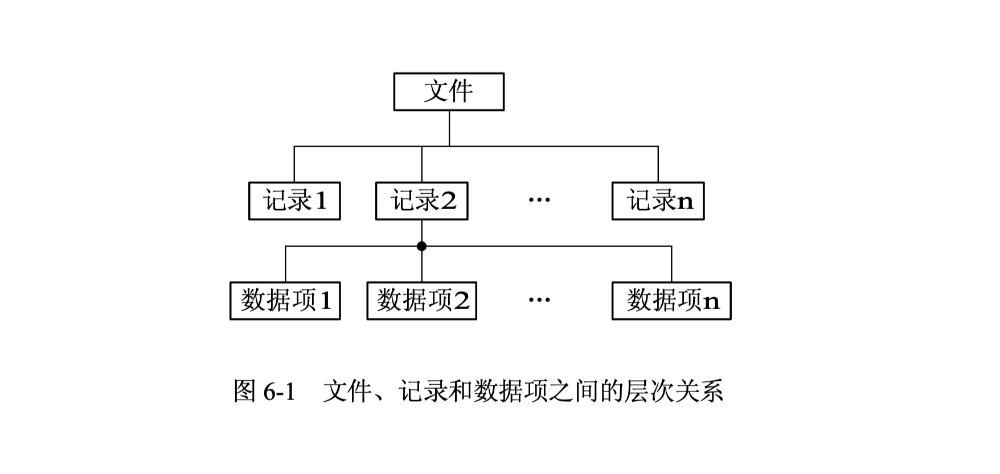
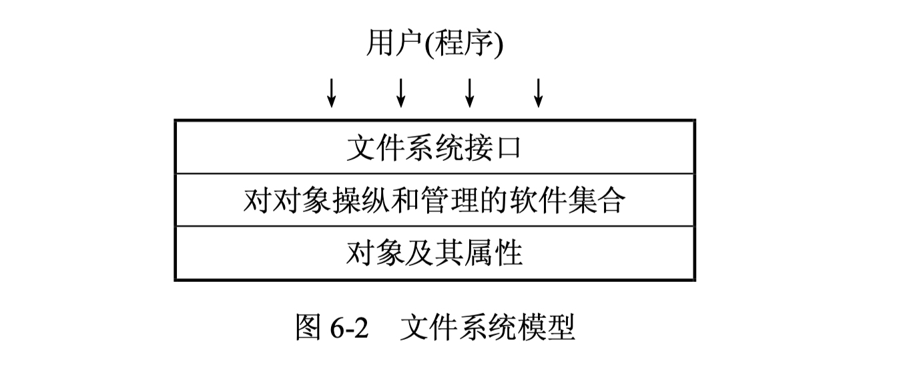
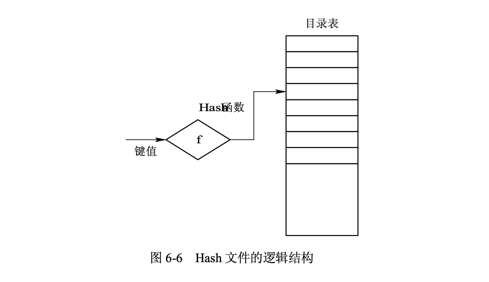
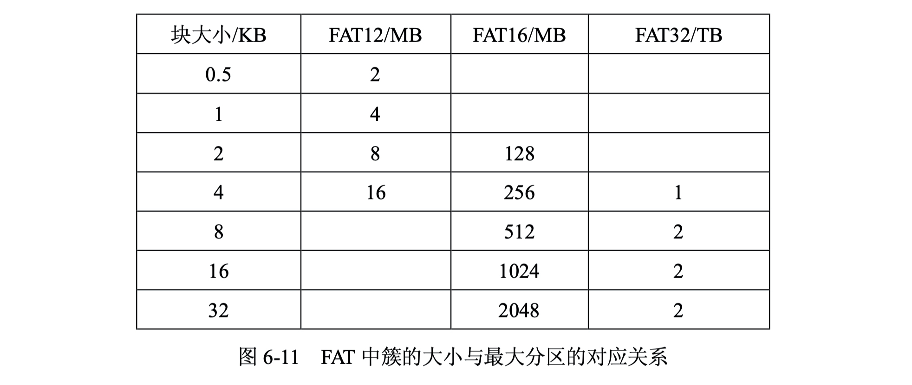
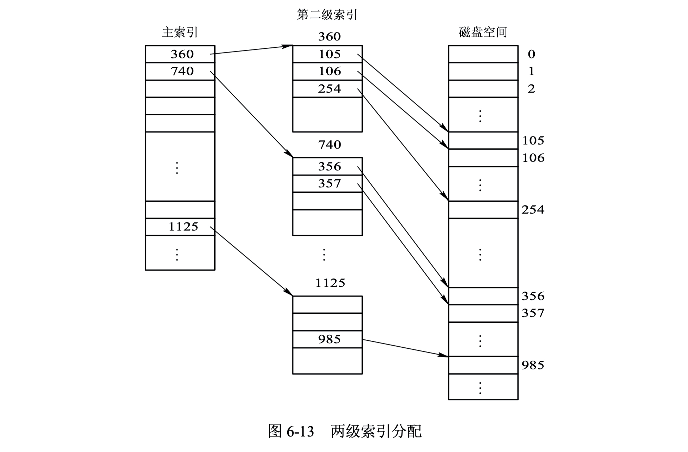
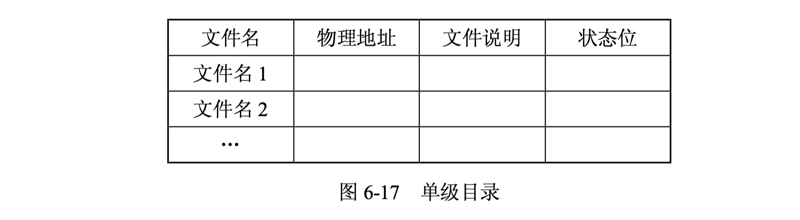
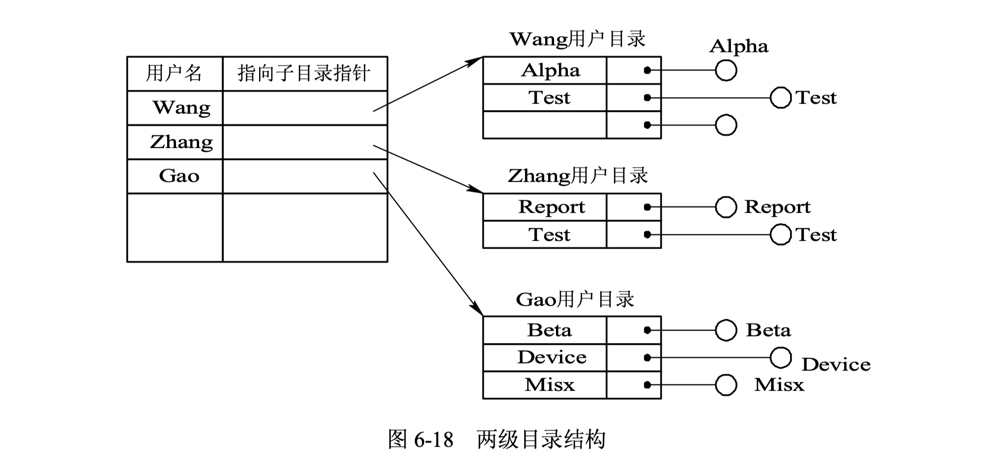
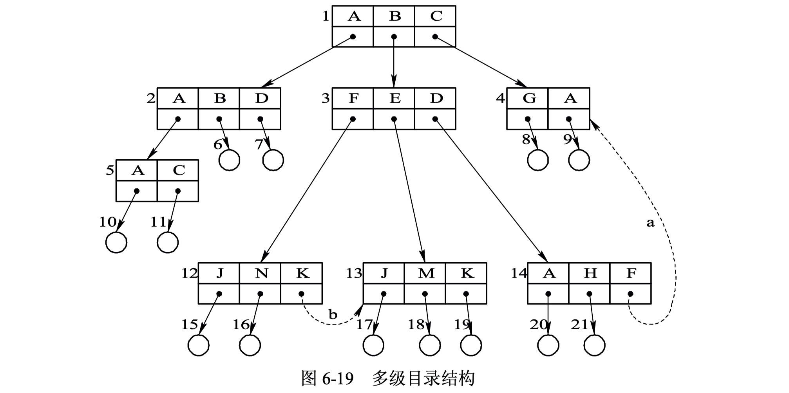
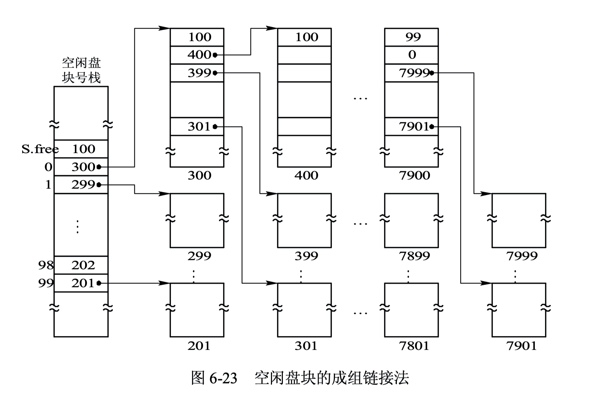



# 1. 文件和文件系统
文件系统的管理功能是通过将其所管理的程序和数据组织成一系列文件来实现的。

## 1.1 文件层次关系
### 1.1.1 数据项
在文件系统中，数据项是最低级的数据组织形式，包括**基本数据项**和**组合数据项**。基本数据项是用于描述一个对象的某种属性的字符集，是数据组织中可以命名的最小逻辑数据单位，即原子数据，又称为数据元素或字段。组合数据项是有若干基本数据项组成的，简称组项。

### 1.1.2 记录
记录是一组相关数据项的集合，用于描述一个对象在某方面的属性。

### 1.1.3 文件
文件是指由创建者所定义的、具有文件名的一组相关记录的集合，可分为**有结构文件**（若干相关记录组成的文件）和**无结构文件**（文件被看做字符流）。文件具有自己的属性：文件类型、文件长度、文件的物理位置、文件的创建时间等。

## 1.2 文件类型
- 普通文件：由ASCII码或二进制码组成的字符文件。
- 目录文件：由文件目录组成，用来管理和实现文件系统功能的系统文件，通过目录文件可对其他文件的信息进行检索。
- 特殊文件：特指系统中的各类I/O设备，可分为块设备文件和字符设备文件。

## 1.3 文件系统模型
文件系统模型可分为三个层次：对象及其属性；对对象进行操纵和管理的软件集合；文件系统接口。


**对象及其属性**

文件管理系统管理的对象有：  
1. 文件：文件管理的直接对象
2. 目录：方便对文件的存取和索引，每个目录项中必须含有文件名及该文件所在的物理地址（指针）
3. 磁盘存储空间：文件和目录必定占用存储空间



**对对象操纵和管理的软件集合**

文件系统的核心部分，主要功能包括：
1. 文件存储空间的管理
2. 文件目录的管理
3. 文件逻辑地址和物理地址的转换机制
4. 文件读写的管理
5. 文件共享和保护



**文件系统接口**

1. 命令接口
2. 程序接口：系统调用


## 1.4 文件操作
1. 创建文件：分配必要的外存空间，建立目录项
2. 删除文件：从目录中查找对应的目录项并使之成为空项，回收该文件占用的存储空间
3. 读文件
4. 写文件
5. 截断文件
6. 设置文件读/写位置

# 2. 文件的逻辑结构
文件逻辑结构是用户视角的文件组织形式，它独立于文件的物理特性（存储方式）。文件逻辑结构可分为记录式文件（有结构文件）和流式文件（字符流）。

## 2.1 记录式文件
### 2.1.1 顺序文件
由一系列记录按照某种顺序排列所形成的文件，其中的记录通常是定长记录。
- 文件记录可以按照写入时间排序（串结构），也可以按照关键字排序（顺序结构）。
- 对串结构文件查找每次必须从头开始
- 对顺序结构文件查找可以使用如折半查找、插值查找等算法
- 删除或增加记录需要移动其他记录

### 2.1.2 索引文件
当记录的长度可变时，通常建立一张索引表，并为每个记录设置一个表项。
- 顺序存取和直接实现方便
- 当记录较多时索引表需要较多额外存储资源
  
### 2.1.3 索引顺序文件
为文件建立一张索引表，为**每组记录**的第一个记录设置一个表项，组内组织为顺序结构，
- 组间索引，组内顺序

## 2.2 直接文件和哈希文件
### 2.2.1 直接文件
根据记录的键值对线性表或链表进行检索，已找到指定记录的物理地址，即记录键值本身觉得记录的物理地址。
### 2.2.2 哈希文件
利用Hash函数将记录键值转换为相应记录的地址，通过目录表可实现文件存储空间的动态分配。

# 3. 外存分配方式
## 3.1 连续分配方式
连续分配要求为每个文件分配一组相邻的盘块。一组盘块的地址定义了磁盘上的一段线性地址。
- 顺序访问容易、速度快
- 要求连续的存储空间，必须事先知道文件的长度，容易产生外部碎片

## 3.2 链接分配
通过每个盘块上的链接指针将同属于一个文件的多个离散盘块链接成一个链表，离散分配，消除外部碎片，提高外存利用率，增删改查方便。
- 隐式链接：每个盘块保护文件开始、文件结束盘块和下一个盘块的指针。
- 显式链接：将盘块指针显式的放在内存的一张链接表（文件分配表，FAT）中。
为提高效率，可以将连续的盘块组合为簇，以簇为分配单位。

- FAT需要占用较大的内存空间
- 不能支持高效的直接存取

## 3.3 索引分配
### 3.3.1 单级索引分配
将每个文件对应的盘块号集中存放，为每个文件分配一个索引块（表），再把分配给该文件的所有盘块号都记录在索引块中。
- 支持直接访问
- 不会产生外部碎片
- 对小文件需要块索引利用率极低

### 3.3.2 多级索引分配
一级索引表 -> 二级索引表 -> 三级索引表 -> ... -> 盘块号

### 3.3.3 混合索引分配
将多种索引分配方式相结合而形成的一种分配方式。
- 直接地址
- 一次间接地址
- 多次间接地址

# 4. 目录管理
对目录管理的基本要求：
+ 按名存取
+ 提高目录的检索速度
+ 文件共享
+ 运行文件重名

## 4.1 文件控制块和索引节点
**文件控制块FCB**：文件与文件控制块一一对应，一个文件控制块就是一个文件目录项。文件控制块的有序集合称为文件目录，通常一个文件目录可以被看做是一个文件，称为目录文件。

FCB通常包含三类信息：基本信息、存取控制信息和使用信息。 
- 基本信息：文件名，文件物理位置，文件逻辑结构（流式文件or记录式文件），文件物理结构（顺序文件、链接文件、索引文件）
- 存取控制信息：文件的存取权限（user, group, other）
- 使用信息：文件建立日期，修改日期，当前使用信息等。

**索引节点（i节点）**：将文件名和文件描述信息分开，使文件描述信息单独形成一个称为索引节点的数据结构。在文件目录中的每个目录项仅由文件名和指向该文件所对应的i节点的指针所构成。

- 磁盘索引节点：存储在磁盘上的所有节点，主要包括文件标识符、文件类型、存取权限、物理地址等。
- 内存索引节点：存放于内存中的所有节点，当文件打开时将磁盘索引节点拷贝到内存中，增加索引节点编号，状态，访问计数，链接指针等信息。

## 4.2 文件目录结构
### 4.2.1 单级目录结构
整个文件系统仅建立一张目录表。缺点：查找速度慢、不允许重名、不便于文件共享。

### 4.2.2 两级目录
系统建立一个主文件目录（MFD），并为每个用户单独建立一个用户文件目录(UFD)。两级目录提高了目录检索速度，不同的用户文件可以重名，可实现不同用户访问共享文件。

### 4.3.1 多级目录
树形目录结构，主目录称为**根目录**，数据文件称为树叶，其他目录均作为树的节点。为提高文件系统的灵活性，允许一个目录文件中的目录项机作为目录文件的FCB，又是数据文件的FCB，增加一位指示位即可。

- 路径名：从根目录到当前访问的文件
- 当前目录：用户当前访问的目录
  - 绝对路径：唯一，从根目录开始
  - 相对路径：不唯一

## 4.3 目录查询技术
### 4.3.1 线性检索法
根据目录结构顺序检索。
### 4.3.1 Hash检索法
建立文件目录的Hash表，先将文件名变换为文件目录的索引值，再利用该索引值到目录中查找。
- 可能存在冲突：不同文件名相同Hash值
- 不支持模式匹配功能
  
# 5. 文件存储空间管理
## 5.1 空闲表法和空闲链表法
**空闲表法**属于**连续分配方式**，为每个文件分配一块连续的存储空间。系统为外存上的所有空闲区建立一张空闲表，每个空闲区对于一个空闲表项。

外存存储空间分配的基本单位是**磁盘块**，而不是字节。


**空闲链表法**属于**离散分配方式**，将所有空闲盘区组成一条空闲链，可分为空闲盘块链表和空闲盘区链表。

## 5.2 位示图法
位示图利用二进制位来表示磁盘中盘块的使用情况，0表示空闲，1表示已分配。

## 5.3 成组链接法
将空闲盘块分组，取前面的组存储空闲的盘块组，类似于多级目录的形式。**最后一组的最后一个盘块用于结尾标志**。

# 6. 文件共享与文件保护
## 6.1 文件共享
- 基于索引节点的文件共享
- 基于符号链接的文件共享

## 6.2 文件保护
影响文件安全性的主要因素：
1. 人为因素：人有意或无意行为导致的数据破坏或丢失
2. 系统因素：系统出现异常导致的数据破坏或丢失，如磁盘出现故障或损坏
3. 自然因素：数据随时间发生溢出或逐渐消失

可采取的措施：
1. 存取控制机制防止人为因素造成的文件不安全性
2. 磁盘容错技术防止磁盘故障所造成的文件不安全性
3. 后备系统防止自然因素导致的文件不安全性

### 6.2.1 磁盘容错技术
1. 磁盘镜像
2. 磁盘双工
3. 基于集群的容错：双机热备份，公用磁盘

# 7. 数据一致性控制
## 7.1 事务
事务时用于访问和修改各种数据项的程序单位，可以看做是一系列相关读写操作。

事务记录：
- 事务名
- 数据项名
- 旧值
- 新值

## 7.2 检查点
引入检查点，对事务记录表中的事务记录的清理工作周期化，每各一段时间进行事务记录清理。

## 7.3 并发控制
