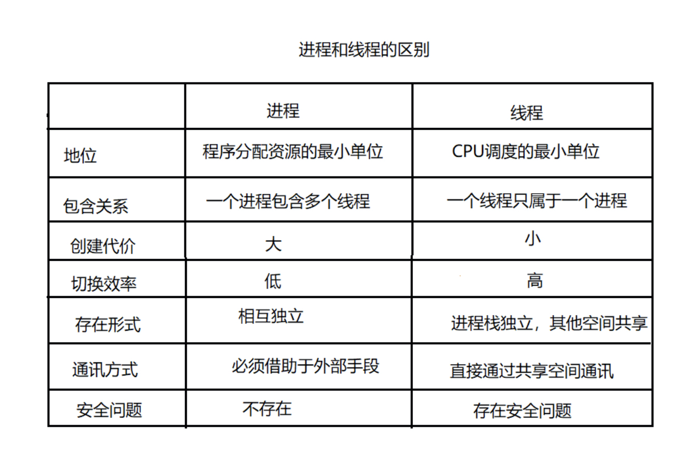



# 1. 基本概念
1. 进程（Process）  
进程是一个动态的概念，通常指的是`进程实体 = PCB + 程序段 + 数据段`。PCB主要包括程序计数器，程序上下文，程序资源（文件、信号等）等。

2. 线程（Thread）   
线程实际上是进程内部的一条执行序列（执行流），执行序列是指一组有序指令加数据的集合，执行序列是以**函数**为单位的。**线程是一种轻量级的进程**。线程一定是在进程内部进行活动的，并且每一个线程都拥有一个独立的计数器、进程栈和一组进程寄存器。强调一点，**进程调度的对象是线程，而不是进程**。

3. 协程（Coroutine）    
协程是一种**用户态的轻量级线程，调度由用户控制**，拥有自己独立的寄存器上下文和栈。**协程的切换效率比线程还要高**，协程和线程的区别包括：
- 线程是由CPU调度，而协程是由用户调度
- 线程存在安全问题，协程比线程较安全
- 线程使用同步机制，协程使用异步机制

4. 管程（Monitor）  
管程是一种程序设计语言结构部分，是代表共享资源的数据结构，以及对该共享数据结构实施操作的一组过程所组成的资源管理程序，共同构成了一个操作系统的资源管理模块。**管程被请求和释放 资源的进程所调用**。本质上，管程是一种抽象数据结构（ADT）。

# 2. 进程和线程的区别
1. 进程是系统资源分配的最小单位，线程是CPU调度的最小单位
2. 一个进程可以包含多个线程，一个线程只能属于一个进程
3. 进程创建的资源消耗比线程创建的资源消耗大很多
4. 进程切换的效率比线程切换的效率低很多
5. 系统中的进程相互独立，而同一个进程内的线程只有自己的程序计数器和栈区，其他空间共享
6. 进程间通信必须借助外部手段，同一个进程内线程间通信可以借助共享空间
7. 进程间不存在安全问题，同一个进程内的线程间存在安全问题

# 3. 进程的状态
一般情况下，将进程分为以下5中状态：
1. 创建（New）: 进程正在被创建，尚未到达就绪转态
2. 就绪（Ready）：准备运行状态，除了处理器以外的所有资源均已获得，一旦得到处理器资源即可运行
3. 运行（Running）：进程正在处理器上运行
4. 阻塞（waiting）：进程正在等待某一事件而暂停或等待某一资源可用或等待I/O操作完成。即使处理器空闲，进程也不能运行
5. 结束（Terminated）：进程正在从系统中消失，可能是正常结束也可能是其他原因中断退出

# 4. 进程间通信方式
系统中的进程相互独立，通信需要借助外部手段。大概有7种方式实现进程间通信：
## 4.1 管道/匿名管道
   匿名管道
## 4.2 有名管道
## 4.3 信号
## 4.4 消息队列
## 4.5 信号量
## 4.6 共享内存
## 4.7 套接字

# 5. 线程间同步

# 6. 进程调度算法
## 6.1 先到先服务（FCFS）调度算法
## 6.2 短作业优先（SJF）调度算法
## 6.3 时间片轮转（RR）调度算法
## 6.4 多级反馈队列调度算法
## 6.5 优先级调度算法

Reference:
- https://blog.csdn.net/love10_1314/article/details/97282627
- 《计算机操作系统》 汤小丹，第三版
- [进程间通信IPC (InterProcess Communication)](https://www.jianshu.com/p/c1015f5ffa74)