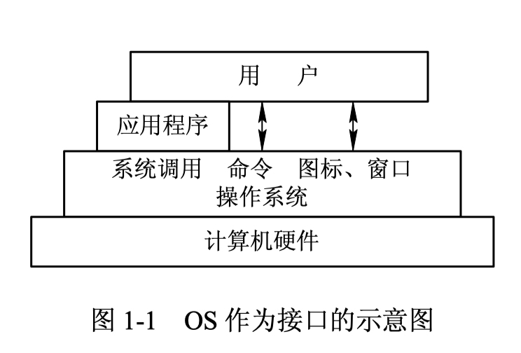
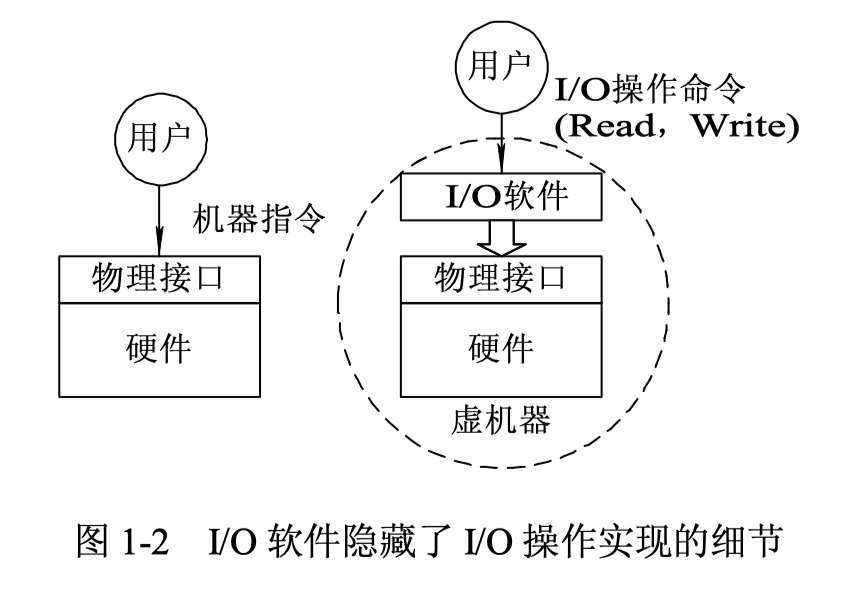
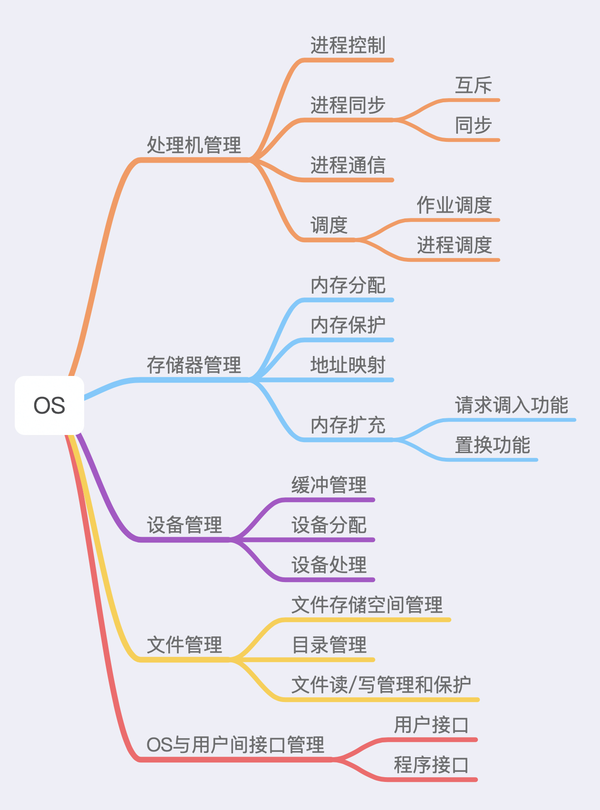

## 1. 什么是操作系统？
1. 操作系统是管理计算机硬件和软件资源的程序，是计算机的基石。
2. OS本质上是配置在计算机硬件上的第一层软件，用于管理计算机硬件和软件资源。
3. OS做为用户和计算机硬件系统之间的接口，屏蔽了硬件层的复杂性。操作系统就像是硬件使用的负责人，统筹着各种相关事项。
4. 操作系统内核是操作系统的核心部分，它负责系统的内存管理，硬件设备管理，文件系统管理和应用程序管理。内核是连接应用程序和硬件之间的桥梁，决定着系统的性能和稳定性。

## 2. 什么是系统调用？
根据**进程访问资源**的特点，可以将进程在系统上的运行分为两个级别：      
+ 用户态：用户态运行的进程可以直接读取用户程序的数据
+ 系统态：系统态运行的进程几乎可以访问计算机的任何资源，不受限制

一般情况下用户程序都是运行在用户态，当需要调用操作系统的系统态级别的子功能的时候就需要**系统调用**了。也就是说用户程序中凡是与系统态级别的资源的操作，如文件管理、进程控制、内存管理等，就需要通过系统调用的方式向操作系统提出服务请求，并由操作系统代为完成。

系统调用按功能大致可分为：
1. 设备管理：完成设备的请求或释放，以及设备的启动等功能。
2. 文件管理：完成文件读、写、创建和删除等功能。
3. 内存管理：完成内存的分配，回收，虚拟地址转换等功能。
4. 进程控制：完成进程的创建，撤销，阻塞以及唤醒等功能。
5. 进程通信：完成进程之间的消息传递或信号传递等功能。

